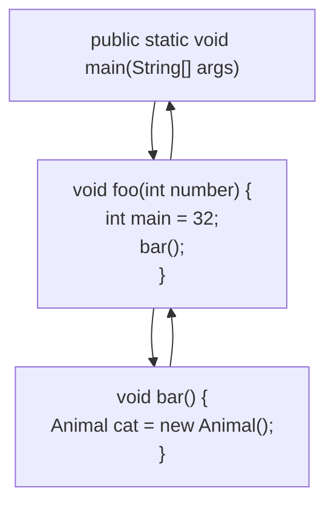

Stack is one of two kinds of memory in [[JVM]] that is used to store temporary variables, functions and primitive data types. In case that object is used, Stack only contains the reference to it that points to the actual value in the [[Heap]]. Stack is actually the stack, it means that you are able to insert new stack blocks on top of each other and pop them from the top, you can't insert new stack blocks in the middle, bottom or pop them from the middle, bottom or the other way around. Stack follows LIFO(Last-in First-out) structure that essentially means that it processes the last entry first.

When function is invoked, a new stack is pushed on top of the topmost one that call has been made from. The variables that are used in the functions are created, including method arguments (of course because they are essentially variables). When function is returned, it is popped from the stack. and block becomes free for other function to take.

Each [[Thread]] has its own Stack so it is bound to the Thread's scope.

Stack memory is generally much smaller than the [[Heap]], usually 512-1024KB per thread, while [[Heap]]
is limited by the physical memory and some kind of Operating System limits and also you  are able to restrict the amount of heap space available for JVM by configuration. However, due to small space available for Stack, it is much faster than [[Heap]], because it behaves like a RAM, and we can treat [[Heap]] as hard disk. In life, RAM is much faster than [[Heap]] because it doesn't actually store any data after you unplug your computer from electricity or power on the phone is drained. It is used to store some kind of caches and processes so applications you are using run faster, while hard disk is used to store data. It has slower read-time but it will contain some data after losing power to run.

Stack memory can never be collected by [[Garbage Collector]] due to its short lifetime.