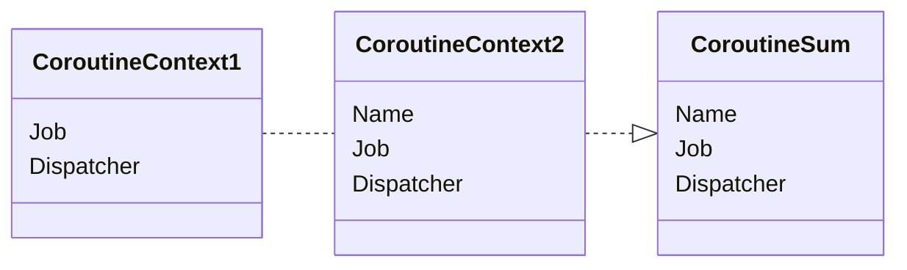

Is a typical Map where each type is represented as [[Element]] and has its own unique [[Key]]. CoroutineContext can be merged using `plus` operator.

Dispatchers are gonna be merged, values that have same [[Key]], gonna be taken from right. It is useful when you want to combine multiple [[Job]] instances